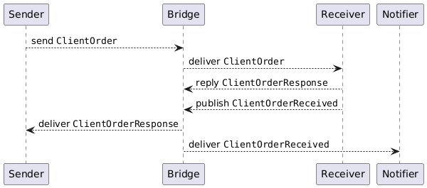

# Sample Project

## Configuration

All endpoints are using:
- NServiceBus v8
- MS SQL Server transport (`NServiceBus.Transport.SqlServer` v7.*)

Bridge is using:
- NServiceBus v9
- NServiceBus.MessagingBridge v4
- MS SQL Server transport (`NServiceBus.Transport.SqlServer` v8.*)

## Observed Behavior

- When "Notifier" starts, an entry is added to `SubscriptionRouting` in its database, as expected.
- When "Bridge" starts, an entry is added to `SubscriptionRouting` in "Receiver"'s database, as expected.

  At the same time, an entry is added to `SubscriptionRouting` in "Sender"'s database: this is unexpected (IMHO), although it apparently is not causing any issue (in this scenario).